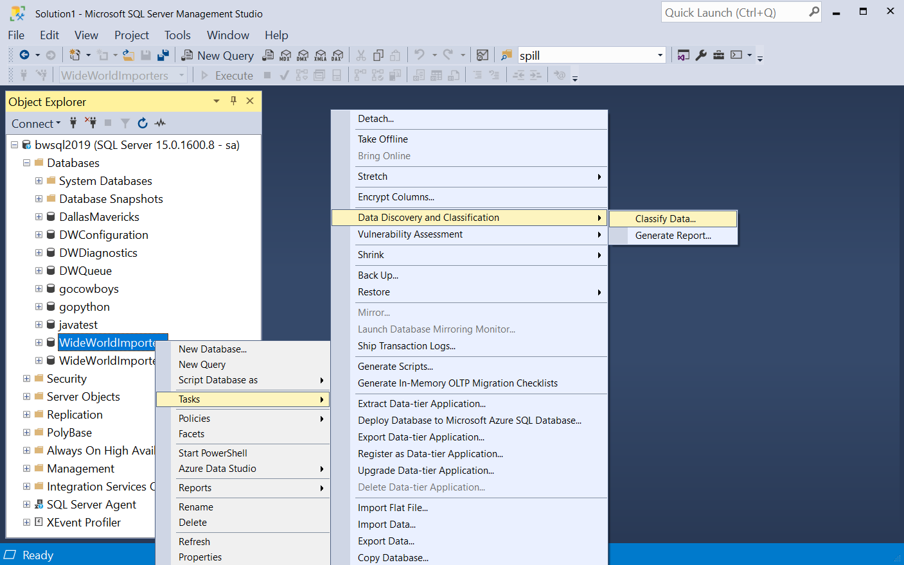
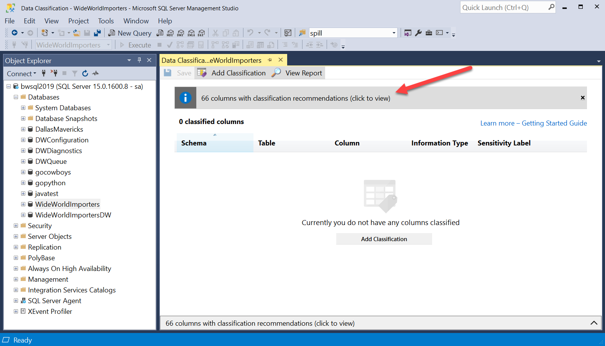
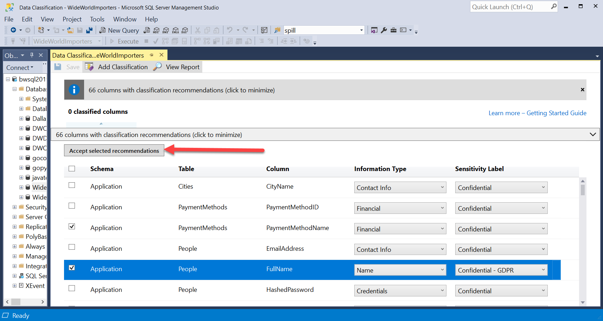
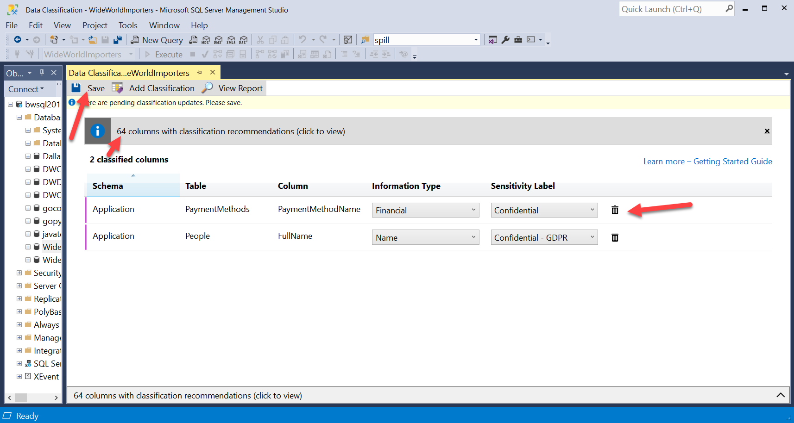
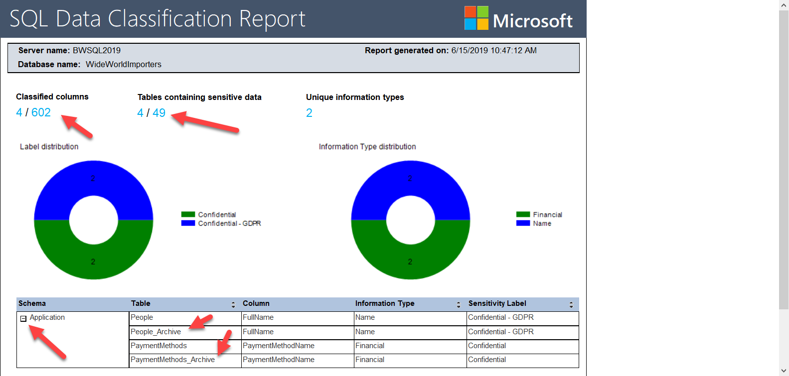

# Workshop: SQL Server 2019 Workshop

#### <i>A Microsoft workshop from the SQL Server team</i>

<p style="border-bottom: 1px solid lightgrey;"></p>

<h2><b>     SQL Server 2019 Security</b></h2>

SQL Server 2019 has new security enhancements including:

- Always Encrypted with Secure Enclaves
- Data Classification and Auditing
- Transparent Data Encryption (TDE) Suspend and Resume
- Improved Certificate Management

You can read more details about all of these enhancements at https://docs.microsoft.com/en-us/sql/sql-server/what-s-new-in-sql-server-ver15?view=sqlallproducts-allversions.

You will cover the following topics in this Module:

<dl>

  <dt><a href="#3-0">3.0 Data Classification</a></dt>
  <dt><a href="#3-1">3.1 Auditing Data Classification</a></dt>
  
</dl>

<p style="border-bottom: 1px solid lightgrey;"></p>

<h2><a name="3-0"><b>     3.0 Data Classification</a></b></h2>

In this module you will learn about the Data Classification capabilities in SQL Server 2019.

<h3><b><a name="challenge">The Challenge</a></b></h3>

Many organization face the challenge of classifying their data and auditing access to data that is classified. Regulations such as General Data Protection Regulation (GDPR) have requirements for business to be able to easily find and report on data access. Having the ability to classify data at the column level with SQL Server can assist to meet these type of regulations. Furthermore, auditing of data that is marked as classified can also assist with regulations and compliance from government agencies or industry standards.

<h3><b><a name="solution">The Solution</a></b></h3>

In SQL Server 2017, SQL Server Management Studio (SSMS) was enhanced to include the ability to classify data based on *labels* and *types* you could associate with columns in a table. This solution was built into the SSMS tool.

SQL Server 2019 includes data classification capabilities built-in to the SQL Server Engine through the new T-SQL statement

```sql
ADD SENSITIVITY CLASSIFICATION
```

Now classification information is stored directly with columns in metadata in system tables. There are two separate pieces of metadata for the classification feature

**label** - This represents the sensitivity of data but can be any string you choose. An example of a label would be *GDPR*.

**information_type** - This represents the type of data that is being classified. This can be any string you choose. An example of an information_type would be *Financial*

The added benefit of built-in classification is that now auditing of data classification is included. SSMS starting with version 18 (you should use 18.2 or greater) has been enhanced to take advantage of this new T-SQL feature.

>**NOTE**: *The use of data classification and auditing with SQL Server does not imply an organization has met requirements like GDPR. SQL Server is providing some of the capabilities needed by organizations to meet certain regulations and compliance standards. It is up to a business or organization to use these tools to meet their requirements or regulations.*

Data Classification and Auditing is a feature that exists for both SQL Server 2019 and Azure SQL Database. You can read the documentation for data discovery and classification for SQL Server, Azure SQL Database, and Azure SQL Data Warehouse at https://docs.microsoft.com/en-us/azure/sql-database/sql-database-data-discovery-and-classification.

The best way to see how data classification and auditing can help an organization is to see it in action.

Proceed to the Activity to learn an example of how to use Data Classification with SSMS and with T-SQL.

<p style="border-bottom: 1px solid lightgrey;"></p>

<h2><b><a name="activity3.0">     Activity: Data Classification</a></b></h2>

In this activity, you will learn how to use SQL Server Management Studio (SSMS) and T-SQL to classify columns of tables in a database. You will use the **WideWorldImporters** sample database to classify specific columns in tables of that database.

>**NOTE**: *If at anytime during the Activities of this Module you need to "start over" you can go back to the first Activity in 3.0 and run through all the steps again.*

<h3><b><a name="activitysteps3.0">Activity Steps</a></b></h3>

Follow these steps to classify certain columns in the WideWorldImporters database using SSMS and T-SQL. All scripts for this activity can be found in the **sql2019workshop\03_Security\dataclassification** folder.

>**NOTE**: *SSMS 18.1 has a bug where data classification through the tools has an issue if the database compatibility level is NOT 150. Therefore, you must have SSMS 18.2 (or greater) to go through this activity or set the dbcompat of WideWorldImporters to 150 if using a version < SSMS 18.2.*

**STEP 1: Restore the WideWorldImporters backup.**

> **NOTE**: If you have restored the WideWorldImporters database backup in other modules, you can skip this step.

Use a tool like SQL Server Management Studio (SSMS) or Azure Data Studio (ADS) to execute the T-SQL script **restorewwi.sql** as found in the **sql2019workshop\03_Security\dataclassification** folder to restore the WideWorldImporters backup. The script assumes a specific path for the backup and database/log files. You may need to edit this depending on your installation. *Remember for Linux installations, the default path is /var/opt/mssql/data.* Your instructor may have provided this backup for you but if necessary you can download it from https://github.com/Microsoft/sql-server-samples/releases/download/wide-world-importers-v1.0/WideWorldImporters-Full.bak.

**STEP 2: Setup the activity**

Open up the script **setup_classification.sql** in SQL Server Management Studio (SSMS) and execute each step in the script or copy and paste these T-SQL commands to execute them

```sql
-- Step 1: In case you have run these demos before drop existing classifications
USE WideWorldImporters
GO
IF EXISTS (SELECT * FROM sys.sensitivity_classifications sc WHERE object_id('[Application].[PaymentMethods]') = sc.major_id)
BEGIN
    DROP SENSITIVITY CLASSIFICATION FROM [Application].[PaymentMethods].[PaymentMethodName]
END
GO
IF EXISTS (SELECT * FROM sys.sensitivity_classifications sc WHERE object_id('[Application].[People]') = sc.major_id)
BEGIN
    DROP SENSITIVITY CLASSIFICATION FROM [Application].[People].[FullName]
    DROP SENSITIVITY CLASSIFICATION FROM [Application].[People].[EmailAddress]
END
GO
```

**STEP 3: Add classifications using the wizard in SSMS**

>**NOTE**: *SSMS still supports using Data Discover and Classification against older versions of SQL Server but will use the older technique built into the tool. Auditing will not be available for these scenarios.*

- Launch SSMS and select the Data Discovery and Classification option as a Task from WideWorldImporters in Object Explorer



- View recommendations from the tool

SSMS analyzes column names in the database and creates recommendations for data classification for labels and information_type.

Select "click to view" in the gray bar to see the recommendations for WideWorldImporters



- Select a few columns based on recommendations

The recommendations provided by the tool are fixed and cannot be customized (you will see later how to add your own). To see how this information is saved, click on the columns **PaymentMethodName** and **FullName**. Then click on 
**Accept selected recommendations**.



- Save the recommendations

The tool shows you the recommendations you accepted. You could delete these and choose others at this point (do not do this for this lab). Notice there are 2 less recommendations.

Click the save button to save your recommendations. The tool will run the corresponding ADD SENSITIVITY CLASSIFICATION T-SQL statements when you click Save.



- View a report of classifications

SSMS has a report that shows classifications saved in the database both with the tool and through any ADD SENSITIVITY CLASSIFICATION execution.

On the window where you clicked the Save button, click the View Report button. A new tab will be created with a report that looks like the following



The report shows details of what is marked for classification and a total of how many columns and tables are marked with classifications based on totals in the database.

Click the **+** in the table on the Application schema to see all columns marked for classification.

You will notice in the report that tables are columns for *Archive* tables are listed. This is because you saved classification on tables that have temporal tables in WideWorldImporters. Any classification added to a table with temporal tables automatically has columns in those temporal tables marked for classification. You don't need to take any action, this happens behind the scenes (When you drop a classification any classification for associated temporal tables is also dropped).

**STEP 4: View classifications using system catalog views.**

SQL Server provides system catalog views to view all classification metadata in a database.

Execute the script **findclassifications.sql** to view classifications added to the database. You can also execute the T-SQL statements from the script


```sql
USE WideWorldImporters
GO
SELECT o.name as table_name, c.name as column_name, sc.information_type, sc.information_type_id, sc.label, sc.label_id
FROM sys.sensitivity_classifications sc
JOIN sys.objects o
ON o.object_id = sc.major_id
JOIN sys.columns c
ON c.column_id = sc.minor_id
AND c.object_id = sc.major_id
ORDER BY sc.information_type, sc.label
GO
```
Your results should look the same as the table at the bottom of the report from the previous step.

**STEP 5: Add your own classifications**

The wizard in SSMS allows you to add your own classifications but you must pick the list of label and information_type values built into the tool. What if you wanted to add your own values for labels and information_type? You can use the T-SQL command **ADD SENSITIVITY CLASSIFICATION**.

The **addclassification.sql** script contains an example to add a new classification for the **[Application].[People].[EmailAddress]** column. This example uses an information_type of **Email** and a label of **PII** (which stands for Personably Identifiable Information). Execute this script to add the new classification and look at the system catalog view to see all classifications.


```sql
-- Step 1: Add the classification
ADD SENSITIVITY CLASSIFICATION TO
[Application].[People].[EmailAddress]
WITH (LABEL='PII', INFORMATION_TYPE='Email')
GO

-- Step 2: View all classifications
USE WideWorldImporters
GO
SELECT o.name as table_name, c.name as column_name, sc.information_type, sc.information_type_id, sc.label, sc.label_id
FROM sys.sensitivity_classifications sc
JOIN sys.objects o
ON o.object_id = sc.major_id
JOIN sys.columns c
ON c.column_id = sc.minor_id
AND c.object_id = sc.major_id
ORDER BY sc.information_type, sc.label
GO
```
Your results from the catalog view query should look like the following


Notice the results have columns for **information_type_id** and **label_id**. These are GUID values that you can use instead of just string values. Your organization's data catalog system may require a unique ID for tracking classification metadata. Remember the **NEWID()** T-SQL function can be used to generate unique GUID values. The SSMS tool generates **information_type_id** and **label_id** values.

<h3><b><a name="activitysummary">Activity Summary</a></b></h3>

In this activity you have learned now to use SSMS and T-SQL to create data classification label and information_type metadata for columns in a database. You have also learned how to use a report in SSMS to view classification metadata or system catalog views to see more details.

Armed with this knowledge, proceed to the next activity to learn how auditing is integrated with data classification in SQL Server 2019.

<p style="border-bottom: 1px solid lightgrey;"></p>

<h2><b><a name="3-1">     3.1 Auditing Data Classification</a></b></h2>

In this module you will learn how to use the SQL Server Audit capability that comes with SQL Server to audit who, what, and when attempted to view columns that are marked for classification.

<h3><b><a name="challenge">The Challenge</a></b></h3>

Classifying data is only the first step. Organizations need to track and audit details of users that attempt to view data marked with classification labels and types.

<h3><b><a name="solution">The Solution</a></b></h3>

SQL Server Audit is a feature of SQL Server to audit all types of access to the SQL Server instance and databases. You can read more about SQL Server Audit at https://docs.microsoft.com/en-us/sql/relational-databases/security/auditing/sql-server-audit-database-engine.

SQL Server 2019 includes a new property with audit called *data_sensitivity_information*. Now when a user attempts to view a column, for example with a SELECT statement, that is marked for classification, this property will contain the label and information_type details from the classification.

Let's use an activity to see how audit and classification work together.

<p style="border-bottom: 1px solid lightgrey;"></p>

<h2><b><a name="activity3.1">     Activity: Using SQL Server Audit with Data Classification</a></b></h2>

In this activity you will learn how to audit users trying to view columns that were marked for data classification.

>**IMPORTANT**: *This activity assumes you have completed the steps in the Activity for Module 3.0.*

>**NOTE**: *If at anytime during the Activities of this Module you need to "start over" you can go back to the first Activity in 3.0 and run through all the steps again.*

<h3><b><a name="activitysteps3.1">Activity Steps</a></b></h3>

Work through the following steps to enable SQL Server Audit and view auditing details when a user attempts to view columns that are associated with data classification.

All scripts can be found in the **sql2019workshop\03_Security\dataclassification** directory. You can use any T-SQL tool to run these scripts such as SQL Server Management Studio (SSMS) or Azure Data Studio.

**STEP 1: Cleanup any previous examples**

If you have never run this module activity on your SQL Server, you can skip this step. Otherwise, execute all the steps in the script **dropsqlaudit.sql**
>**NOTE**: *For Linux installations you will need to change the path when deleting past audits to /var/opt/mssql/data.*

```sql
-- Step 1: Disable the audits and drop them
USE WideWorldImporters
GO
IF EXISTS (SELECT * FROM sys.database_audit_specifications WHERE name = 'People_Audit')
BEGIN
    ALTER DATABASE AUDIT SPECIFICATION People_Audit 
    WITH (STATE = OFF)
    DROP DATABASE AUDIT SPECIFICATION People_Audit
END
GO
USE master
GO
IF EXISTS (SELECT * FROM sys.server_audits WHERE name = 'GDPR_Audit')
BEGIN
    ALTER SERVER AUDIT GDPR_Audit
    WITH (STATE = OFF)
    DROP SERVER AUDIT GDPR_Audit
END
GO

-- Step 2: Remove the .audit files from default or your path
-- Note: Remember for Linux installations, the default path is /var/opt/mssql/data
-- del C:\program files\microsoft sql server\mssql15.mssqlserver\mssql\data\GDPR*.audit
```
**STEP 2: Setup an audit to track SELECT statements against the table**

Use the T-SQL script **setupsqlaudit.sql** to create and enable a new SQL Audit to track SELECT statements against the **[Application].[People]** table in the **WideWorldImporters** database

>**NOTE**: *For Linux installations change the path to /var/opt/mssql/data*

```sql
USE master
GO  
-- Create the server audit.   
-- Note: Remember for Linux installations, the default path is /var/opt/mssql/data
CREATE SERVER AUDIT GDPR_Audit
    TO FILE (FILEPATH = 'C:\program files\microsoft sql server\mssql15.mssqlserver\mssql\data')
GO  
-- Enable the server audit.   
ALTER SERVER AUDIT GDPR_Audit
WITH (STATE = ON)
GO
USE WideWorldImporters
GO  
-- Create the database audit specification.   
CREATE DATABASE AUDIT SPECIFICATION People_Audit
FOR SERVER AUDIT GDPR_Audit
ADD (SELECT ON Application.People BY public )   
WITH (STATE = ON) 
GO
```
This module will not go into the details of how SQL Server Audit works. You can get more information on SQL Server Audit at https://docs.microsoft.com/en-us/sql/relational-databases/security/auditing/sql-server-audit-database-engine.

**STEP 3: Scan all columns of the table**

Use the script **findpeoplescan.sql** to scan all columns for all rows.

```sql
-- Scan the table and see if the sensitivity columns were audited
USE WideWorldImporters
GO
SELECT * FROM [Application].[People]
GO
```

**STEP 4: Check the audit**

Use the script **checkaudit.sql** to see the if anything was audited.

>**NOTE**: *For Linux installations change the path to /var/opt/mssql/data*

```sql
-- Check the audit
-- The audit may now show up EXACTLY right after the query but within a few seconds.
-- Note: Remember for Linux installations, the default path is /var/opt/mssql/data
SELECT event_time, session_id, server_principal_name,
database_name, object_name, 
cast(data_sensitivity_information as XML) as data_sensitivity_information, 
client_ip, application_name
FROM sys.fn_get_audit_file ('C:\program files\microsoft sql server\mssql15.mssqlserver\mssql\data\*.sqlaudit',default,default)
GO
```
The system function **fn_get_audit_file**() can be used to obtain results from SQL Server Audit files (which are extended event files)

Your results should look like the following:


The first row is a record that the audit has started. The second row is an audit of the SELECT statement. The **data_sensitivity_information** column contains an XML record of the **label** and **information_type** values associated with columns that have data classifications. This includes the information to look up what columns are affected through the **sys.sensitivity_columns** catalog view.

Keep the **checkaudit.sql** query tab available in SSMS as you will use it again over the next several steps.

**STEP 5: SELECT one column from the table**

Use the script **findpeopleonecolumn.sql** to query only one column that is marked for classification.

```sql
-- What if I access just one of the columns directly?
SELECT FullName FROM [Application].[People]
GO
```
**STEP 6: Check the audit again**

Use the script **checkaudit.sql** to see the if anything was audited.

>**NOTE**: *For Linux installations change the path to /var/opt/mssql/data*

```sql
-- Check the audit
-- The audit may now show up EXACTLY right after the query but within a few seconds.
-- Note: Remember for Linux installations, the default path is /var/opt/mssql/data
SELECT event_time, session_id, server_principal_name,
database_name, object_name, 
cast(data_sensitivity_information as XML) as data_sensitivity_information, 
client_ip, application_name
FROM sys.fn_get_audit_file ('C:\program files\microsoft sql server\mssql15.mssqlserver\mssql\data\*.sqlaudit',default,default)
GO
```
Your results should now look like the following:


The third row is for the new SELECT statement and the data_sensitivity_information contains an XML record of data classification for only one column.

**STEP 7: Use a column marked for classification in a WHERE clause**

Use the script **findpeoplewhereclause.sql** to query only one column that is marked for classification.

```sql
-- What if I reference a classified column in the WHERE clause only?
SELECT PreferredName FROM [Application].[People]
WHERE EmailAddress LIKE '%microsoft%'
GO
```
This query should return no rows.

**STEP 8: Check the audit again**

Auditing for columns with data classification only apply to queries where columns are in the SELECT "list" of the query. Use the script **checkaudit.sql** to see the if anything was audited.

>**NOTE**: *For Linux installations change the path to /var/opt/mssql/data*

```sql
-- Check the audit
-- The audit may now show up EXACTLY right after the query but within a few seconds.
-- Note: Remember for Linux installations, the default path is /var/opt/mssql/data
SELECT event_time, session_id, server_principal_name,
database_name, object_name, 
cast(data_sensitivity_information as XML) as data_sensitivity_information, 
client_ip, application_name
FROM sys.fn_get_audit_file ('C:\program files\microsoft sql server\mssql15.mssqlserver\mssql\data\*.sqlaudit',default,default)
GO
```
Your results should now look like the following:


Notice in this results for the new row the data_sensitivity_information columns is NULL. This is because auditing for data classification only apply where columns are listed in the SELECT "list" of a query.

**STEP 9: Cleanup audits and classifications**

Use the script **cleanup.sql** to disable and drop audits and delete classifications.

>**NOTE**: *For Linux installations change the path in the script to delete audit files to /var/opt/mssql/data*

```sql
USE WideWorldImporters
GO
IF EXISTS (SELECT * FROM sys.database_audit_specifications WHERE name = 'People_Audit')
BEGIN
    ALTER DATABASE AUDIT SPECIFICATION People_Audit 
    WITH (STATE = OFF)
    DROP DATABASE AUDIT SPECIFICATION People_Audit
END
GO
USE master
GO
IF EXISTS (SELECT * FROM sys.server_audits WHERE name = 'GDPR_Audit')
BEGIN
    ALTER SERVER AUDIT GDPR_Audit
    WITH (STATE = OFF)
    DROP SERVER AUDIT GDPR_Audit
END
GO

-- Remove the .audit files from default or your path
-- Remember for Linux installations, the default path is /var/opt/mssql/data.
-- del C:\program files\microsoft sql server\mssql15.mssqlserver\mssql\data\GDPR*.audit

ALTER DATABASE WideWorldImporters SET COMPATIBILITY_LEVEL = 130
GO

USE WideWorldImporters
GO
IF EXISTS (SELECT * FROM sys.sensitivity_classifications sc WHERE object_id('[Application].[PaymentMethods]') = sc.major_id)
    DROP SENSITIVITY CLASSIFICATION FROM [Application].[PaymentMethods].[PaymentMethodName]
GO
IF EXISTS (SELECT * FROM sys.sensitivity_classifications sc WHERE object_id('[Application].[People]') = sc.major_id)
    DROP SENSITIVITY CLASSIFICATION FROM [Application].[People].[FullName]
    DROP SENSITIVITY CLASSIFICATION FROM [Application].[People].[EmailAddress]
GO
```

<h3><b><a name="activitysummary">Activity Summary</a></b></h3>

In this activity you have seen how SQL Server Audit uses the new property **data_sensitivity_information** to track users who list columns associated with data classifications in a SELECT query. However, audit does not apply to all "usage" of a column that is marked for classification.

<p style="border-bottom: 1px solid lightgrey;"></p>

<h2><b>     For Further Study</b></h2>

- [SQL Server and Azure Data Discovery and classification](https://docs.microsoft.com/en-us/azure/sql-database/sql-database-data-discovery-and-classification)
- [ADD SENSITIVITY CLASSIFICATION](https://docs.microsoft.com/en-us/sql/t-sql/statements/add-sensitivity-classification-transact-sql)

- [sys.sensitivity_classifications catalog view](https://docs.microsoft.com/en-us/sql/relational-databases/system-catalog-views/sys-sensitivity-classifications-transact-sql)
- [SQL Server Audit](https://docs.microsoft.com/en-us/sql/relational-databases/security/auditing/sql-server-audit-database-engine)
- [Always Encrypted with Secure Enclaves](https://docs.microsoft.com/en-us/sql/relational-databases/security/encryption/always-encrypted-enclaves)

<p style="border-bottom: 1px solid lightgrey;"></p>

<h2><b>     Next Steps</b></h2>

Next, Continue to <a href="./04_Availability.md" target="_blank"><i>Availability</i></a>.
